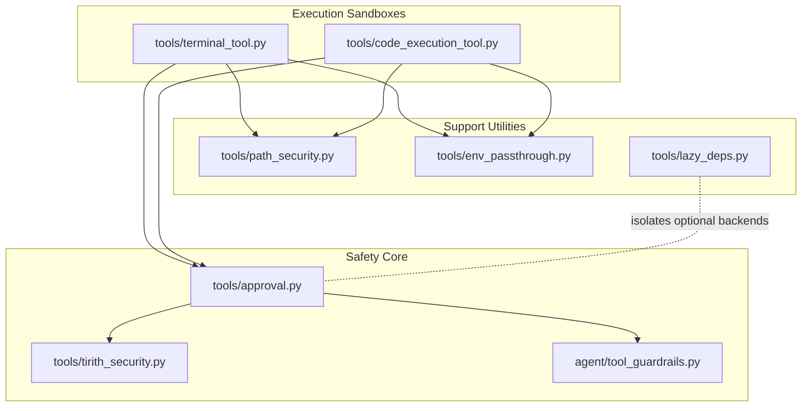
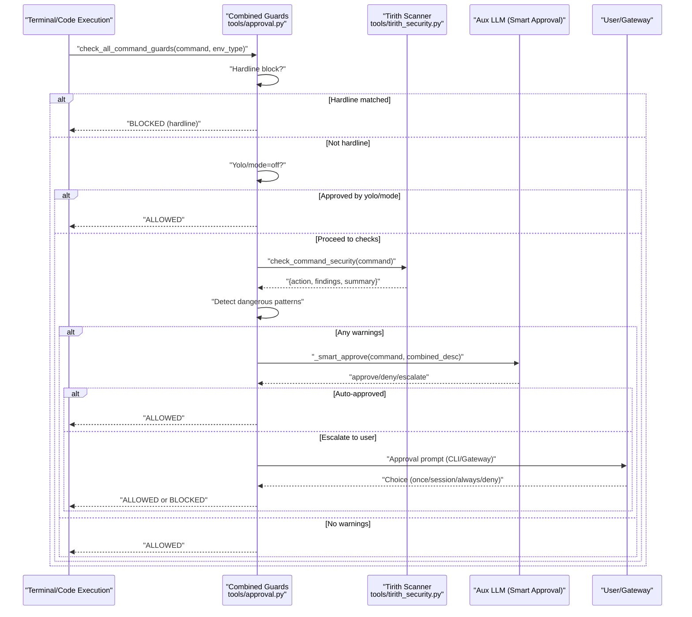
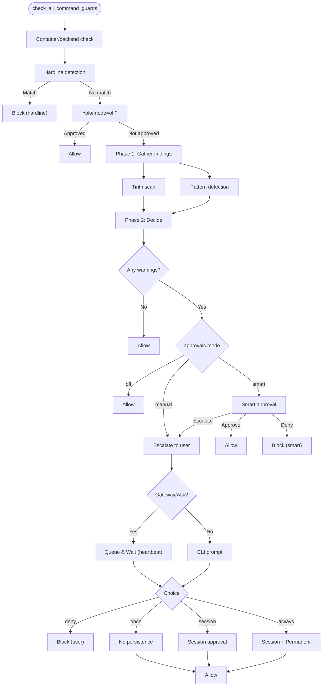
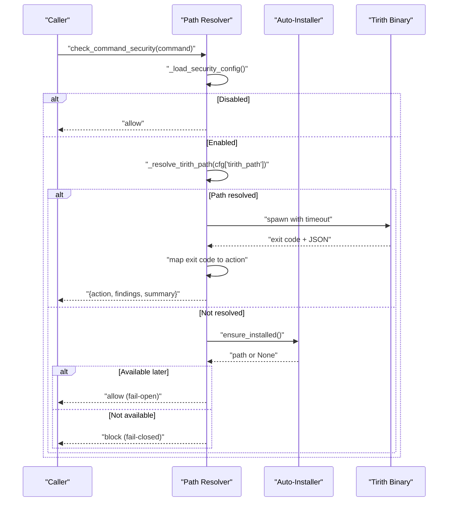
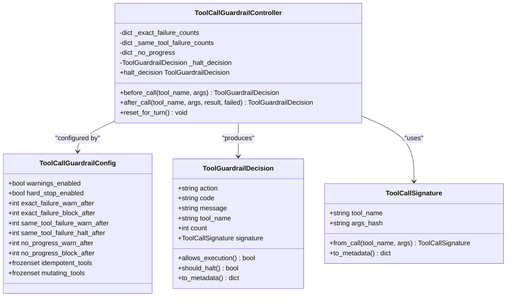
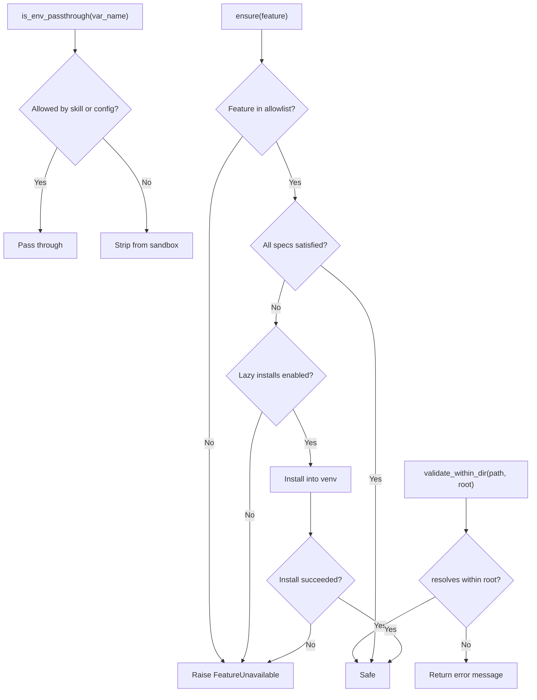
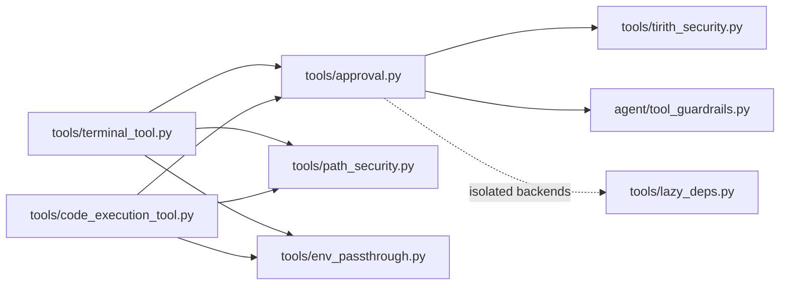

# Tool Safety and Approval System

<cite>
**Referenced Files in This Document**
- [approval.py](file://tools/approval.py)
- [tirith_security.py](file://tools/tirith_security.py)
- [tool_guardrails.py](file://agent/tool_guardrails.py)
- [lazy_deps.py](file://tools/lazy_deps.py)
- [path_security.py](file://tools/path_security.py)
- [env_passthrough.py](file://tools/env_passthrough.py)
- [terminal_tool.py](file://tools/terminal_tool.py)
- [code_execution_tool.py](file://tools/code_execution_tool.py)
</cite>

## Table of Contents
1. [Introduction](#introduction)
2. [Project Structure](#project-structure)
3. [Core Components](#core-components)
4. [Architecture Overview](#architecture-overview)
5. [Detailed Component Analysis](#detailed-component-analysis)
6. [Dependency Analysis](#dependency-analysis)
7. [Performance Considerations](#performance-considerations)
8. [Troubleshooting Guide](#troubleshooting-guide)
9. [Conclusion](#conclusion)
10. [Appendices](#appendices)

## Introduction
This document describes the Tool Safety and Approval System that protects users and systems from potentially dangerous tool execution. It covers:
- Approval workflows: user consent mechanisms, approval UI components, and approval heartbeat systems
- Security guardrails: path traversal prevention, environment variable restrictions, and command injection protection
- Lazy dependency loading for security isolation
- Tirith security framework integration
- Tool execution monitoring, audit logging, and incident response
- Approval policies, escalation procedures, and administrative controls
- Practical examples, security configurations, and troubleshooting

## Project Structure
The safety system spans several modules:
- tools/approval.py: Dangerous command detection, per-session approval state, CLI and gateway approval flows, and smart approval via auxiliary LLM
- tools/tirith_security.py: Content-level security scanning via the Tirith binary with auto-install, fail-open/fail-closed behavior, and platform support detection
- agent/tool_guardrails.py: Tool-loop guardrails to prevent repeated failures and non-productive loops
- tools/lazy_deps.py: Secure, allowlisted, on-demand installation of optional backends to reduce blast radius
- tools/path_security.py: Shared path validation helpers to prevent directory traversal
- tools/env_passthrough.py: Session-scoped environment variable allowlist for sandboxed execution
- tools/terminal_tool.py and tools/code_execution_tool.py: Entry points that invoke the combined safety checks

**Diagram sources**
- [approval.py:1043-1393](file://tools/approval.py#L1043-L1393)
- [tirith_security.py:679-775](file://tools/tirith_security.py#L679-L775)
- [tool_guardrails.py:224-384](file://agent/tool_guardrails.py#L224-L384)
- [terminal_tool.py](file://tools/terminal_tool.py)
- [code_execution_tool.py](file://tools/code_execution_tool.py)
- [path_security.py:15-44](file://tools/path_security.py#L15-L44)
- [env_passthrough.py:125-146](file://tools/env_passthrough.py#L125-L146)
- [lazy_deps.py:1-609](file://tools/lazy_deps.py#L1-L609)

**Section sources**
- [approval.py:1-1393](file://tools/approval.py#L1-L1393)
- [tirith_security.py:1-775](file://tools/tirith_security.py#L1-L775)
- [tool_guardrails.py:1-459](file://agent/tool_guardrails.py#L1-L459)
- [lazy_deps.py:1-609](file://tools/lazy_deps.py#L1-L609)
- [path_security.py:1-44](file://tools/path_security.py#L1-L44)
- [env_passthrough.py:1-146](file://tools/env_passthrough.py#L1-L146)

## Core Components
- Dangerous Command Detection and Approval
  - Pattern-based detection for risky operations (file deletion, permission changes, database operations, service control, process termination, shell/script execution, sudo privilege flags, etc.)
  - Hardline blocklist for catastrophic commands (filesystem destruction, raw block device writes, system shutdown, fork bombs)
  - Per-session approval state with “once,” “session,” and “always” scopes
  - CLI and gateway approval flows with timeouts and heartbeat support
  - Smart approval via auxiliary LLM for borderline cases
  - Integration with plugin hooks for audit and notifications

- Tirith Security Scanning
  - Subprocess execution of the Tirith binary for content-level threats
  - Auto-install with SHA-256 and optional cosign provenance verification
  - Configurable fail-open/fail-closed behavior and timeouts
  - Platform support detection and background installation

- Tool Loop Guardrails
  - Threshold-based detection of repeated failures and non-productive loops
  - Distinction between idempotent and mutating tools
  - Configurable warnings and hard stops

- Security Isolation and Environment Controls
  - Path validation to prevent traversal and escape
  - Environment variable allowlist for sandboxed execution
  - Lazy dependency installation with allowlist and offline detection

**Section sources**
- [approval.py:157-482](file://tools/approval.py#L157-L482)
- [approval.py:484-700](file://tools/approval.py#L484-L700)
- [approval.py:913-1010](file://tools/approval.py#L913-L1010)
- [tirith_security.py:68-87](file://tools/tirith_security.py#L68-L87)
- [tirith_security.py:679-775](file://tools/tirith_security.py#L679-L775)
- [tool_guardrails.py:63-125](file://agent/tool_guardrails.py#L63-L125)
- [tool_guardrails.py:224-384](file://agent/tool_guardrails.py#L224-L384)
- [path_security.py:15-44](file://tools/path_security.py#L15-L44)
- [env_passthrough.py:70-146](file://tools/env_passthrough.py#L70-L146)
- [lazy_deps.py:25-50](file://tools/lazy_deps.py#L25-L50)

## Architecture Overview
The system orchestrates three safety layers:
1) Pattern-based detection and approval (tools/approval.py)
2) Content-level scanning via Tirith (tools/tirith_security.py)
3) Tool-loop guardrails (agent/tool_guardrails.py)

**Diagram sources**
- [approval.py:1043-1393](file://tools/approval.py#L1043-L1393)
- [tirith_security.py:679-775](file://tools/tirith_security.py#L679-L775)

## Detailed Component Analysis

### Dangerous Command Detection and Approval
Key capabilities:
- Hardline blocklist for catastrophic commands
- Comprehensive pattern library for risky operations
- Per-session approval state with thread-safe queues and gateway integration
- CLI and gateway approval flows with timeouts and heartbeat support
- Smart approval via auxiliary LLM for borderline cases
- Plugin hooks for audit and notifications

**Diagram sources**
- [approval.py:1043-1393](file://tools/approval.py#L1043-L1393)

**Section sources**
- [approval.py:157-482](file://tools/approval.py#L157-L482)
- [approval.py:484-700](file://tools/approval.py#L484-L700)
- [approval.py:913-1010](file://tools/approval.py#L913-L1010)
- [approval.py:1012-1393](file://tools/approval.py#L1012-L1393)

### Tirith Security Framework Integration
Key capabilities:
- Auto-install with platform detection and background thread
- SHA-256 verification and optional cosign provenance verification
- Configurable timeout and fail-open/fail-closed behavior
- JSON enrichment of findings and summary without overriding exit-code verdict

**Diagram sources**
- [tirith_security.py:679-775](file://tools/tirith_security.py#L679-L775)
- [tirith_security.py:581-669](file://tools/tirith_security.py#L581-L669)

**Section sources**
- [tirith_security.py:68-87](file://tools/tirith_security.py#L68-L87)
- [tirith_security.py:244-252](file://tools/tirith_security.py#L244-L252)
- [tirith_security.py:581-669](file://tools/tirith_security.py#L581-L669)
- [tirith_security.py:679-775](file://tools/tirith_security.py#L679-L775)

### Tool Loop Guardrails
Key capabilities:
- Threshold-based detection of repeated failures and non-productive loops
- Distinction between idempotent and mutating tools
- Configurable warnings and hard stops
- Synthetic results and guidance appended to tool outputs

**Diagram sources**
- [tool_guardrails.py:63-125](file://agent/tool_guardrails.py#L63-L125)
- [tool_guardrails.py:127-174](file://agent/tool_guardrails.py#L127-L174)
- [tool_guardrails.py:224-384](file://agent/tool_guardrails.py#L224-L384)

**Section sources**
- [tool_guardrails.py:20-61](file://agent/tool_guardrails.py#L20-L61)
- [tool_guardrails.py:63-125](file://agent/tool_guardrails.py#L63-L125)
- [tool_guardrails.py:224-384](file://agent/tool_guardrails.py#L224-L384)
- [tool_guardrails.py:386-407](file://agent/tool_guardrails.py#L386-L407)

### Security Isolation and Environment Controls
Key capabilities:
- Path validation to prevent traversal and escape
- Environment variable allowlist for sandboxed execution
- Lazy dependency installation with allowlist and offline detection

**Diagram sources**
- [path_security.py:15-44](file://tools/path_security.py#L15-L44)
- [env_passthrough.py:125-146](file://tools/env_passthrough.py#L125-L146)
- [lazy_deps.py:408-490](file://tools/lazy_deps.py#L408-L490)

**Section sources**
- [path_security.py:15-44](file://tools/path_security.py#L15-L44)
- [env_passthrough.py:70-146](file://tools/env_passthrough.py#L70-L146)
- [lazy_deps.py:25-50](file://tools/lazy_deps.py#L25-L50)
- [lazy_deps.py:408-490](file://tools/lazy_deps.py#L408-L490)

## Dependency Analysis
The approval system integrates tightly with:
- tools/approval.py depends on tools/tirith_security.py for content-level scanning
- tools/approval.py coordinates with agent/tool_guardrails.py for tool-loop behavior
- tools/terminal_tool.py and tools/code_execution_tool.py invoke the combined safety checks
- tools/path_security.py and tools/env_passthrough.py provide foundational security utilities
- tools/lazy_deps.py isolates optional backends to reduce attack surface

**Diagram sources**
- [approval.py:1043-1393](file://tools/approval.py#L1043-L1393)
- [tirith_security.py:679-775](file://tools/tirith_security.py#L679-L775)
- [tool_guardrails.py:224-384](file://agent/tool_guardrails.py#L224-L384)
- [terminal_tool.py](file://tools/terminal_tool.py)
- [code_execution_tool.py](file://tools/code_execution_tool.py)
- [path_security.py:15-44](file://tools/path_security.py#L15-L44)
- [env_passthrough.py:125-146](file://tools/env_passthrough.py#L125-L146)
- [lazy_deps.py:1-609](file://tools/lazy_deps.py#L1-L609)

**Section sources**
- [approval.py:1043-1393](file://tools/approval.py#L1043-L1393)
- [tirith_security.py:679-775](file://tools/tirith_security.py#L679-L775)
- [tool_guardrails.py:224-384](file://agent/tool_guardrails.py#L224-L384)
- [lazy_deps.py:1-609](file://tools/lazy_deps.py#L1-L609)

## Performance Considerations
- Pattern compilation caching: pre-compiled regex lists minimize overhead on repeated detections
- Hot-path normalization: ANSI stripping, null-byte removal, and Unicode normalization reduce evasion and improve detection speed
- Background installation: Tirith auto-install runs in a background thread to avoid startup latency
- Lazy dependency installation: on-demand installs reduce initial footprint and resolve conflicts
- Heartbeat during gateway waits: periodic activity touch mitigates false timeouts during user approval

[No sources needed since this section provides general guidance]

## Troubleshooting Guide
Common issues and resolutions:
- Approval prompt not visible or deadlocks
  - Symptom: Silent 60s timeout or prompt_toolkit conflicts
  - Cause: Missing approval callback on interactive threads
  - Resolution: Ensure approval callback is registered before prompting; see CLI prompt handling and callback registration
  - Section sources
    - [approval.py:736-750](file://tools/approval.py#L736-L750)

- Gateway approval never resolves
  - Symptom: Blocking wait until timeout despite user response
  - Cause: Missing gateway notify callback or unresolved queue entry
  - Resolution: Verify gateway callback registration; ensure queue cleanup and heartbeat touch occur
  - Section sources
    - [approval.py:1186-1341](file://tools/approval.py#L1186-L1341)
    - [approval.py:1237-1299](file://tools/approval.py#L1237-L1299)

- Tirith spawn failures or timeouts
  - Symptom: Fail-open/fail-closed behavior with warnings
  - Causes: Missing binary, permission issues, network timeouts, unsupported platform
  - Resolution: Check auto-install logs, verify platform support, adjust fail-open settings, or configure explicit path
  - Section sources
    - [tirith_security.py:704-741](file://tools/tirith_security.py#L704-L741)
    - [tirith_security.py:244-252](file://tools/tirith_security.py#L244-L252)

- Path traversal attempts flagged
  - Symptom: Validation errors for paths escaping allowed directories
  - Resolution: Use allowed root and validate paths with provided helpers
  - Section sources
    - [path_security.py:15-44](file://tools/path_security.py#L15-L44)

- Environment variables stripped unexpectedly
  - Symptom: Required variables not available in sandbox
  - Resolution: Register skill-required variables or configure terminal.env_passthrough
  - Section sources
    - [env_passthrough.py:70-146](file://tools/env_passthrough.py#L70-L146)

- Lazy install blocked or fails
  - Symptom: FeatureUnavailable exceptions
  - Causes: Disabled lazy installs, unsafe specs, offline environment
  - Resolution: Enable lazy installs, verify allowlist, or install manually
  - Section sources
    - [lazy_deps.py:438-470](file://tools/lazy_deps.py#L438-L470)
    - [lazy_deps.py:334-389](file://tools/lazy_deps.py#L334-L389)

## Conclusion
The Tool Safety and Approval System combines pattern-based detection, content-level scanning, and guardrails to protect users and systems from dangerous tool execution. It supports flexible approval modes, robust user consent flows, and strong isolation controls. Administrators can tune behavior via configuration, while developers can extend approval hooks and integrate additional scanners.

## Appendices

### Approval Modes and Configuration
- approvals.mode: manual, smart, off
- approvals.timeout: CLI prompt timeout
- approvals.cron_mode: deny, approve
- security.allow_lazy_installs: enable/disable lazy installs
- TIRITH_* environment variables and config keys

**Section sources**
- [approval.py:839-864](file://tools/approval.py#L839-L864)
- [approval.py:845-851](file://tools/approval.py#L845-L851)
- [tirith_security.py:68-87](file://tools/tirith_security.py#L68-L87)
- [lazy_deps.py:216-233](file://tools/lazy_deps.py#L216-L233)

### Practical Examples
- Approval flows
  - CLI interactive: combined prompt with “once/session/always/deny”
  - Gateway async: queue-based blocking with heartbeat and plugin hooks
  - Cron: respect cron_mode; otherwise bypass approvals
- Security configurations
  - Enable Tirith with fail-open/fail-closed behavior
  - Configure env passthrough for required variables
  - Use path validation helpers in tool implementations
- Troubleshooting
  - Review approval logs and hook events
  - Inspect Tirith auto-install status and platform support
  - Validate lazy install results and environment constraints

**Section sources**
- [approval.py:954-1010](file://tools/approval.py#L954-L1010)
- [approval.py:1082-1106](file://tools/approval.py#L1082-L1106)
- [approval.py:1186-1341](file://tools/approval.py#L1186-L1341)
- [tirith_security.py:581-669](file://tools/tirith_security.py#L581-L669)
- [env_passthrough.py:125-146](file://tools/env_passthrough.py#L125-L146)
- [path_security.py:15-44](file://tools/path_security.py#L15-L44)
- [lazy_deps.py:408-490](file://tools/lazy_deps.py#L408-L490)