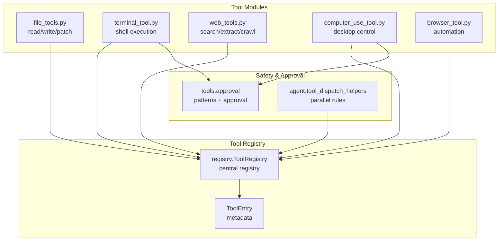
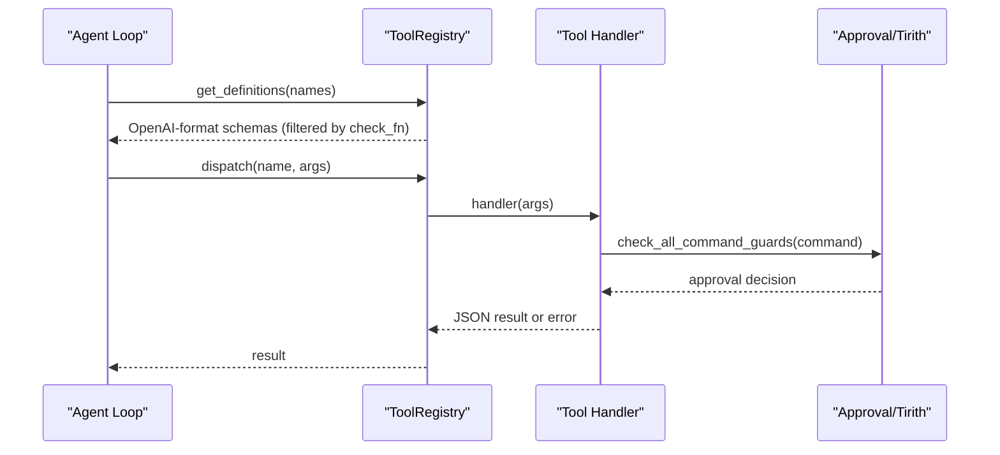
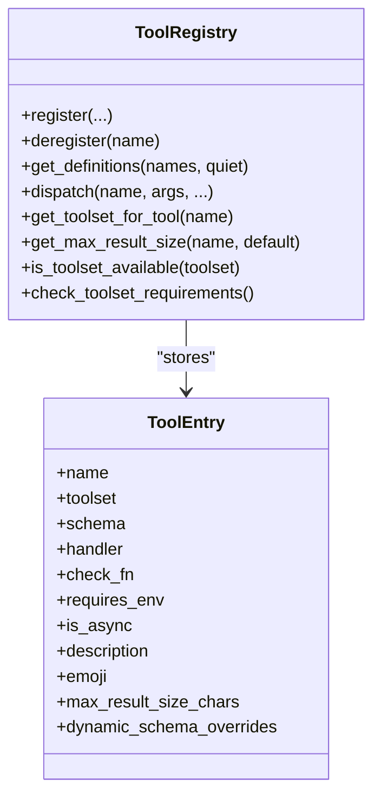
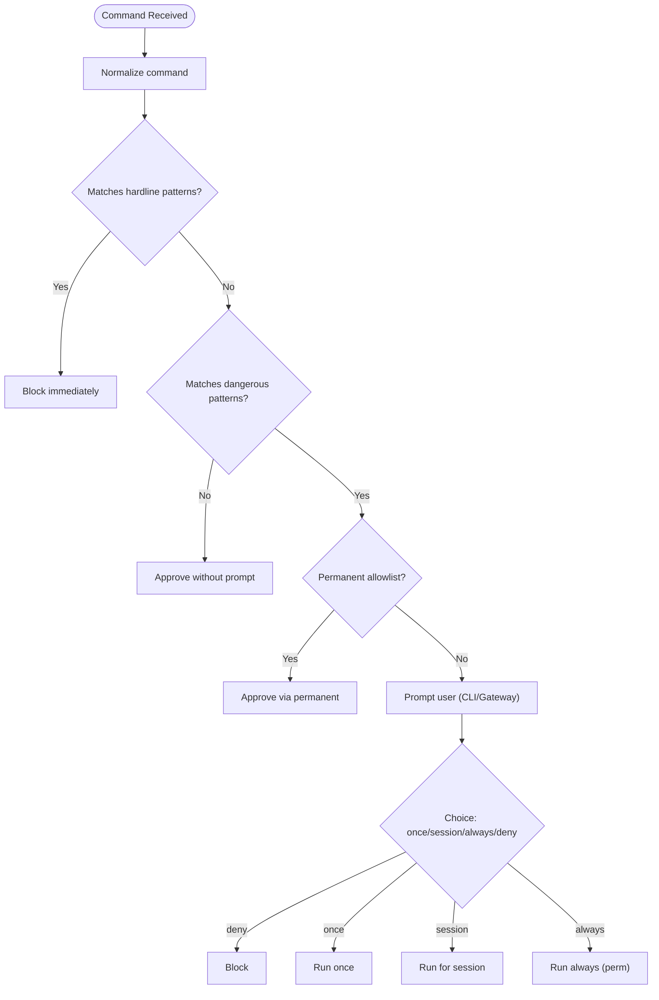
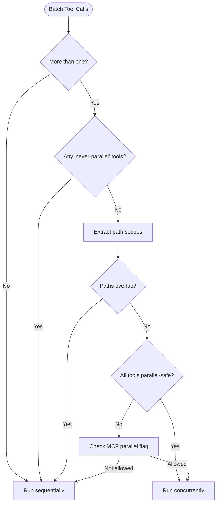
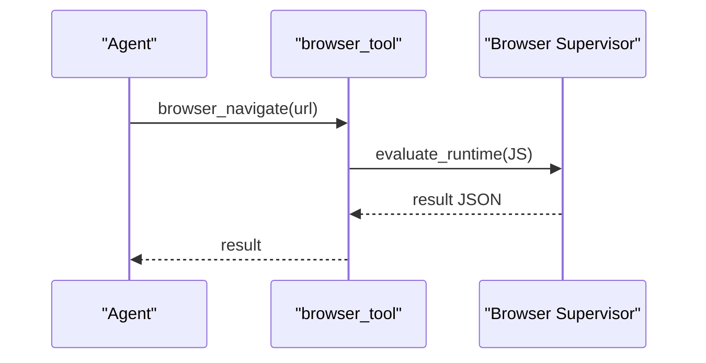
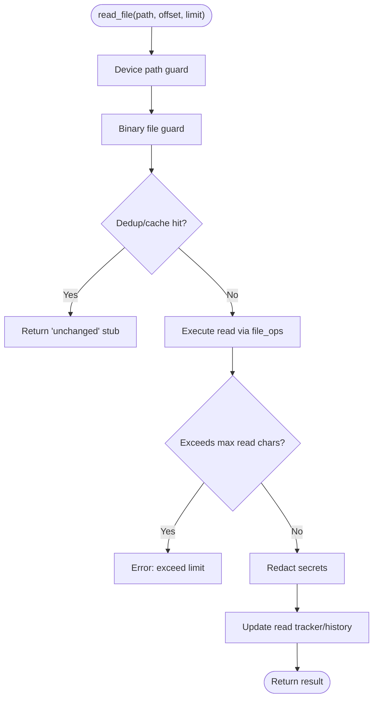
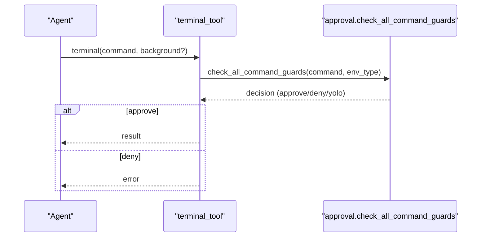
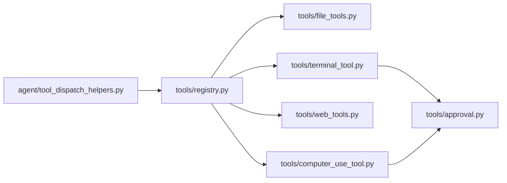

# Tool System

<cite>
**Referenced Files in This Document**
- [tools/registry.py](file://tools/registry.py)
- [tools/__init__.py](file://tools/__init__.py)
- [tools/approval.py](file://tools/approval.py)
- [agent/tool_dispatch_helpers.py](file://agent/tool_dispatch_helpers.py)
- [tools/file_tools.py](file://tools/file_tools.py)
- [tools/terminal_tool.py](file://tools/terminal_tool.py)
- [tools/web_tools.py](file://tools/web_tools.py)
- [tools/computer_use_tool.py](file://tools/computer_use_tool.py)
- [tools/browser_tool.py](file://tools/browser_tool.py)
- [agent/display.py](file://agent/display.py)
- [tests/tools/test_registry.py](file://tests/tools/test_registry.py)
- [tests/tools/test_command_guards.py](file://tests/tools/test_command_guards.py)
- [cli.py](file://cli.py)
</cite>

## Table of Contents
1. [Introduction](#introduction)
2. [Project Structure](#project-structure)
3. [Core Components](#core-components)
4. [Architecture Overview](#architecture-overview)
5. [Detailed Component Analysis](#detailed-component-analysis)
6. [Dependency Analysis](#dependency-analysis)
7. [Performance Considerations](#performance-considerations)
8. [Troubleshooting Guide](#troubleshooting-guide)
9. [Conclusion](#conclusion)
10. [Appendices](#appendices)

## Introduction
This document describes the Tool System that enables the agent to interact with external services and execute actions safely and efficiently. It covers the tool registry and definition system, tool schemas and parameter validation, execution interfaces, and the safety and approval system. It also documents built-in tools organized by function, parallel execution capabilities, error handling, and result processing. Practical usage examples, configuration options, integration patterns, and development guidelines for creating custom tools are included, along with performance optimization and monitoring guidance.

## Project Structure
The Tool System is centered around a central registry that collects tool schemas and handlers from tool modules. Tool modules self-register at import time, and the registry exposes discovery and dispatch APIs. Safety and approval logic is integrated into terminal and computer-use tools, and parallel execution rules are enforced in the agent’s dispatch helpers.

**Diagram sources**
- [tools/registry.py:151-544](file://tools/registry.py#L151-L544)
- [tools/file_tools.py:447-800](file://tools/file_tools.py#L447-L800)
- [tools/terminal_tool.py:1-200](file://tools/terminal_tool.py#L1-L200)
- [tools/web_tools.py:736-800](file://tools/web_tools.py#L736-L800)
- [tools/computer_use_tool.py:1-40](file://tools/computer_use_tool.py#L1-L40)
- [tools/browser_tool.py:3760-3789](file://tools/browser_tool.py#L3760-L3789)
- [tools/approval.py:1-200](file://tools/approval.py#L1-L200)
- [agent/tool_dispatch_helpers.py:1-120](file://agent/tool_dispatch_helpers.py#L1-L120)

**Section sources**
- [tools/registry.py:1-120](file://tools/registry.py#L1-L120)
- [tools/__init__.py:1-26](file://tools/__init__.py#L1-L26)

## Core Components
- Central Tool Registry: Provides registration, discovery, availability checks, dispatch, and tool metadata queries.
- Tool Modules: Implement handlers and schemas; self-register via the registry.
- Safety and Approval: Pattern-based detection, approval prompts, and per-session state.
- Parallel Execution: Rules to safely run multiple tools concurrently when safe.
- Result Serialization: Helpers to return consistent JSON results and errors.

Key responsibilities:
- Tool registration and availability gating via check_fn.
- OpenAI-style tool schema generation with dynamic overrides.
- Safe execution with error sanitization and result size limits.
- Approval gating for dangerous commands and computer use.
- Parallel execution rules for file and other tools.

**Section sources**
- [tools/registry.py:151-544](file://tools/registry.py#L151-L544)
- [tools/approval.py:1-120](file://tools/approval.py#L1-L120)
- [agent/tool_dispatch_helpers.py:103-147](file://agent/tool_dispatch_helpers.py#L103-L147)

## Architecture Overview
The Tool System architecture consists of:
- Tool Discovery: Built-in tool modules self-register via registry.register().
- Tool Definition: Each tool defines a schema and handler, optionally with availability checks and environment requirements.
- Tool Dispatch: The registry dispatches by name, bridging async handlers and sanitizing errors.
- Safety Integration: Terminal and computer-use tools integrate with the approval system.
- Parallel Execution: The agent enforces parallelism rules based on tool categories and path scopes.

**Diagram sources**
- [tools/registry.py:337-417](file://tools/registry.py#L337-L417)
- [tools/approval.py:698-800](file://tools/approval.py#L698-L800)
- [tools/terminal_tool.py:324-328](file://tools/terminal_tool.py#L324-L328)

## Detailed Component Analysis

### Tool Registry and Definition System
- Registration: Tools call registry.register with name, toolset, schema, handler, optional check_fn, requires_env, is_async, description, emoji, max_result_size_chars, dynamic_schema_overrides, and override.
- Availability: Toolset availability is controlled by check_fn; results are TTL-cached to amortize external checks.
- Discovery: get_definitions returns OpenAI-format tool definitions, applying dynamic overrides and filtering unavailable tools.
- Dispatch: dispatch executes handlers synchronously or bridges async handlers, catching and sanitizing exceptions.
- Metadata: Utilities to query tool metadata, toolset requirements, and max result sizes.

**Diagram sources**
- [tools/registry.py:77-107](file://tools/registry.py#L77-L107)
- [tools/registry.py:234-306](file://tools/registry.py#L234-L306)
- [tools/registry.py:337-417](file://tools/registry.py#L337-L417)

**Section sources**
- [tools/registry.py:126-148](file://tools/registry.py#L126-L148)
- [tools/registry.py:182-191](file://tools/registry.py#L182-L191)
- [tools/registry.py:337-417](file://tools/registry.py#L337-L417)
- [tools/registry.py:422-431](file://tools/registry.py#L422-L431)
- [tools/registry.py:459-476](file://tools/registry.py#L459-L476)
- [tools/registry.py:499-540](file://tools/registry.py#L499-L540)

### Safety and Approval System
- Pattern-based detection: Hardline and dangerous patterns block or require approval.
- Approval prompts: CLI and gateway flows provide “once/session/always/deny” choices with timeouts.
- Session state: Thread-safe per-session approval state, permanent allowlists, and YOLO modes.
- Integration: Terminal and computer-use tools delegate to the approval system for dangerous commands.

**Diagram sources**
- [tools/approval.py:198-220](file://tools/approval.py#L198-L220)
- [tools/approval.py:316-415](file://tools/approval.py#L316-L415)
- [tools/approval.py:698-800](file://tools/approval.py#L698-L800)

**Section sources**
- [tools/approval.py:198-220](file://tools/approval.py#L198-L220)
- [tools/approval.py:316-415](file://tools/approval.py#L316-L415)
- [tools/approval.py:488-627](file://tools/approval.py#L488-L627)
- [tools/approval.py:698-800](file://tools/approval.py#L698-L800)
- [tests/tools/test_command_guards.py:1-41](file://tests/tools/test_command_guards.py#L1-L41)

### Parallel Tool Execution
- Rules: Certain tools must run sequentially; others are safe to parallelize. Path-scoped tools (read/write/patch) can run concurrently if they target disjoint paths.
- Heuristics: Detect destructive commands to avoid risky parallel batches.
- MCP-aware: Parallelism checks include MCP tools that opt-in to parallel calls.

**Diagram sources**
- [agent/tool_dispatch_helpers.py:103-147](file://agent/tool_dispatch_helpers.py#L103-L147)
- [agent/tool_dispatch_helpers.py:149-175](file://agent/tool_dispatch_helpers.py#L149-L175)

**Section sources**
- [agent/tool_dispatch_helpers.py:39-61](file://agent/tool_dispatch_helpers.py#L39-L61)
- [agent/tool_dispatch_helpers.py:103-147](file://agent/tool_dispatch_helpers.py#L103-L147)
- [agent/tool_dispatch_helpers.py:149-175](file://agent/tool_dispatch_helpers.py#L149-L175)

### Built-in Tools by Function

#### Browser Automation
- Tools: Navigation, snapshot, click, press, get images, vision, console, CDP passthrough.
- Availability: Requires browser environment checks; CDP requires a reachable endpoint.
- Examples: Navigate to a URL, take a snapshot, click an element, evaluate JS, handle dialogs.

**Diagram sources**
- [tools/browser_tool.py:3760-3789](file://tools/browser_tool.py#L3760-L3789)

**Section sources**
- [tools/browser_tool.py:3760-3789](file://tools/browser_tool.py#L3760-L3789)
- [website/docs/user-guide/features/browser.md:488-516](file://website/docs/user-guide/features/browser.md#L488-L516)

#### File Operations
- Tools: read_file, write_file, patch.
- Safety: Device path guards, binary file guards, sensitive path guards, deduplication, staleness detection, and secret redaction.
- Pagination and limits: Read size limits and hints for large files; dedup and loop detection.

**Diagram sources**
- [tools/file_tools.py:447-654](file://tools/file_tools.py#L447-L654)

**Section sources**
- [tools/file_tools.py:24-79](file://tools/file_tools.py#L24-L79)
- [tools/file_tools.py:447-654](file://tools/file_tools.py#L447-L654)
- [tools/file_tools.py:793-800](file://tools/file_tools.py#L793-L800)

#### Process Execution (Terminal)
- Tools: Execute commands in local, Docker, Modal, SSH, Singularity, Vercel Sandbox environments.
- Safety: Dangerous command detection, sudo password caching, approval prompts, and workdir validation.
- Background tasks and lifecycle management.

**Diagram sources**
- [tools/terminal_tool.py:324-328](file://tools/terminal_tool.py#L324-L328)
- [tools/approval.py:698-800](file://tools/approval.py#L698-L800)

**Section sources**
- [tools/terminal_tool.py:1-120](file://tools/terminal_tool.py#L1-L120)
- [tools/terminal_tool.py:324-328](file://tools/terminal_tool.py#L324-L328)
- [tools/terminal_tool.py:240-313](file://tools/terminal_tool.py#L240-L313)

#### Communication Tools
- Tools: Send messages, integrate with platforms.
- Implementation varies by platform; registration and availability handled via toolset checks.

[No sources needed since this section doesn't analyze specific files]

#### Development Tools
- Tools: Code execution, vision, memory, skills, and platform integrations.
- Execution via auxiliary clients and tool registries.

[No sources needed since this section doesn't analyze specific files]

#### Creative Tools
- Tools: Image/video generation, vision analysis, and multimodal results.
- Results may include multimodal envelopes with content parts and text summaries.

**Section sources**
- [agent/tool_dispatch_helpers.py:177-235](file://agent/tool_dispatch_helpers.py#L177-L235)

#### Productivity Tools
- Tools: Home Assistant, Notion, Google Workspace, OCR, Powerpoint, Airtable, Teams meeting pipeline.
- Availability gated by environment variables and toolset checks.

[No sources needed since this section doesn't analyze specific files]

### Error Handling and Result Processing
- Consistent JSON responses: tool_error and tool_result helpers.
- Registry sanitization: Errors are sanitized before being returned to the model.
- Result size limits: Configurable per-tool and global defaults.
- Multimodal results: Envelope format with content parts and text_summary.

**Section sources**
- [tools/registry.py:563-590](file://tools/registry.py#L563-L590)
- [tools/registry.py:405-416](file://tools/registry.py#L405-L416)
- [tools/registry.py:422-431](file://tools/registry.py#L422-L431)
- [agent/tool_dispatch_helpers.py:177-235](file://agent/tool_dispatch_helpers.py#L177-L235)

### Practical Usage Examples
- Register a custom tool: Define schema and handler, call registry.register with toolset and optional check_fn.
- Enable/disable tool availability: Use hermes tools commands to toggle toolsets; registry caches check_fn results for ~30s.
- Approve dangerous commands: Use CLI prompts or gateway flows; permanent allowlists can be configured.
- Parallel execution: Batch multiple file operations targeting different paths; destructive commands are heuristically gated.

**Section sources**
- [tools/registry.py:234-306](file://tools/registry.py#L234-L306)
- [tests/tools/test_registry.py:123-171](file://tests/tools/test_registry.py#L123-L171)
- [cli.py:10475-10507](file://cli.py#L10475-L10507)

### Integration Patterns
- Tool discovery: Built-in tools auto-import and self-register; registry discovers modules that call registry.register.
- Dynamic overrides: Tools can supply dynamic schema overrides applied at get_definitions() time.
- Environment requirements: Toolset metadata includes required environment variables for UI display.

**Section sources**
- [tools/registry.py:57-74](file://tools/registry.py#L57-L74)
- [tools/registry.py:372-383](file://tools/registry.py#L372-L383)
- [tools/registry.py:499-520](file://tools/registry.py#L499-L520)

### Tool Development Guidelines
- Define a schema: Use OpenAI function schema format; include name, description, parameters.
- Implement handler: Return JSON via tool_result or tool_error; handle exceptions consistently.
- Availability checks: Provide a check_fn to gate tool availability; results are TTL-cached.
- Security: Integrate with approval system for dangerous commands; avoid destructive operations without user consent.
- Testing: Validate schema, availability, and error paths; test parallel execution rules for path-scoped tools.

**Section sources**
- [tools/registry.py:234-306](file://tools/registry.py#L234-L306)
- [tools/approval.py:698-800](file://tools/approval.py#L698-L800)
- [agent/tool_dispatch_helpers.py:103-147](file://agent/tool_dispatch_helpers.py#L103-L147)

## Dependency Analysis
- Registry-to-tools: Tools import registry and call register; registry remains independent of tool implementations.
- Safety-to-tools: Terminal and computer-use tools import approval; approval is decoupled from tool logic.
- Parallel rules: Agent helpers depend on tool names and path scopes; MCP-aware via lazy import.

**Diagram sources**
- [tools/registry.py:1-26](file://tools/registry.py#L1-L26)
- [tools/file_tools.py:1-25](file://tools/file_tools.py#L1-L25)
- [tools/terminal_tool.py:318-328](file://tools/terminal_tool.py#L318-L328)
- [tools/web_tools.py:1-42](file://tools/web_tools.py#L1-L42)
- [tools/computer_use_tool.py:1-40](file://tools/computer_use_tool.py#L1-L40)
- [agent/tool_dispatch_helpers.py:90-101](file://agent/tool_dispatch_helpers.py#L90-L101)

**Section sources**
- [tools/registry.py:1-26](file://tools/registry.py#L1-L26)
- [agent/tool_dispatch_helpers.py:90-101](file://agent/tool_dispatch_helpers.py#L90-L101)

## Performance Considerations
- TTL caching: check_fn results cached for ~30s to amortize environment checks.
- Read deduplication: Avoid resending unchanged file content; bound per-task trackers to limit memory growth.
- Result size limits: Configurable per-tool and global defaults to control context usage.
- Parallel execution: Safe batching reduces latency for independent operations; destructive command heuristics prevent race conditions.
- Multimodal processing: Text summaries and content-part normalization reduce token overhead.

[No sources needed since this section provides general guidance]

## Troubleshooting Guide
- Unknown tool: dispatch returns an error JSON; verify tool name and registration.
- Tool unavailable: check_fn failed or returned False; confirm environment and credentials.
- Dangerous command blocked: Review hardline and dangerous patterns; use approval prompts or permanent allowlists.
- Parallel execution fallback: If path overlaps or tool not parallel-safe, execution falls back to sequential.
- Error sanitization: Registry sanitizes tool errors before returning to the model.

**Section sources**
- [tests/tools/test_registry.py:115-121](file://tests/tools/test_registry.py#L115-L121)
- [tests/tools/test_registry.py:213-286](file://tests/tools/test_registry.py#L213-L286)
- [tools/registry.py:390-416](file://tools/registry.py#L390-L416)
- [agent/tool_dispatch_helpers.py:103-147](file://agent/tool_dispatch_helpers.py#L103-L147)

## Conclusion
The Tool System provides a robust, extensible framework for agent tooling. The central registry manages discovery, availability, and dispatch, while integrated safety and approval systems protect users from dangerous operations. Parallel execution rules optimize throughput for independent tasks, and consistent result handling ensures reliable integration with the agent loop. Developers can extend the system by adding new tools with clear schemas, handlers, and appropriate safety controls.

## Appendices

### Configuration Options
- file_read_max_chars: Cap for file read content to control context usage.
- auxiliary.web_extract.timeout: Timeout for web summarization LLM calls.
- approvals.timeout: Timeout for approval prompts.
- TERMINAL_MAX_FOREGROUND_TIMEOUT: Foreground command timeout.
- TERMINAL_DISK_WARNING_GB: Disk usage warning threshold.
- web.backend and web.search_backend/web.extract_backend: Backend selection for web tools.

**Section sources**
- [tools/file_tools.py:39-59](file://tools/file_tools.py#L39-L59)
- [tools/web_tools.py:312-317](file://tools/web_tools.py#L312-L317)
- [hermes_cli/callbacks.py:186-218](file://hermes_cli/callbacks.py#L186-L218)
- [tools/terminal_tool.py:107-122](file://tools/terminal_tool.py#L107-L122)
- [tools/terminal_tool.py:186-213](file://tools/terminal_tool.py#L186-L213)
- [tools/web_tools.py:135-203](file://tools/web_tools.py#L135-L203)

### Display and Logging
- Human-friendly tool call summaries for UI and logs.
- Emojis and labels help identify tool actions quickly.

**Section sources**
- [agent/display.py:883-906](file://agent/display.py#L883-L906)