# Troubleshooting and FAQ

<cite>
**Referenced Files in This Document**
- [doctor.py](file://hermes_cli/doctor.py)
- [main.py](file://hermes_cli/main.py)
- [logs.py](file://hermes_cli/logs.py)
- [hermes_logging.py](file://hermes_logging.py)
- [debug.py](file://hermes_cli/debug.py)
- [install.sh](file://scripts/install.sh)
- [install.ps1](file://scripts/install.ps1)
- [setup.py](file://hermes_cli/setup.py)
- [auth.py](file://hermes_cli/auth.py)
- [security_advisories.py](file://hermes_cli/security_advisories.py)
- [base.py](file://gateway/platforms/base.py)
- [test_api_server_bind_guard.py](file://tests/gateway/test_api_server_bind_guard.py)
- [chat_completion_helpers.py](file://agent/chat_completion_helpers.py)
- [codex_app_server_session.py](file://agent/transports/codex_app_server_session.py)
- [delegate_tool.py](file://tools/delegate_tool.py)
</cite>

## Table of Contents
1. [Introduction](#introduction)
2. [Project Structure](#project-structure)
3. [Core Components](#core-components)
4. [Architecture Overview](#architecture-overview)
5. [Detailed Component Analysis](#detailed-component-analysis)
6. [Dependency Analysis](#dependency-analysis)
7. [Performance Considerations](#performance-considerations)
8. [Troubleshooting Guide](#troubleshooting-guide)
9. [Conclusion](#conclusion)
10. [Appendices](#appendices)

## Introduction
This document provides comprehensive troubleshooting guidance and frequently asked questions for the Hermes Agent. It focuses on:
- Diagnostic procedures using the doctor command
- Installation problems and platform-specific fixes
- Runtime issues (conversation, tool execution, gateway connectivity)
- Configuration troubleshooting (providers, authentication, permissions)
- Performance optimization, memory management, and scaling
- Security-related issues (advisories, approvals, credentials, access control)
- Debugging techniques and log analysis
- Community resources and support channels

## Project Structure
The Hermes CLI integrates diagnostics, logging, and platform-specific helpers to streamline troubleshooting. Key modules include:
- Doctor diagnostics for environment, configuration, providers, and security advisories
- Logging subsystem for structured, rotating logs with session context
- Platform-specific installers and setup wizards
- Gateway platform adapters with resource locking and connectivity guards
- Tool and runtime helpers for error classification and partial stream handling

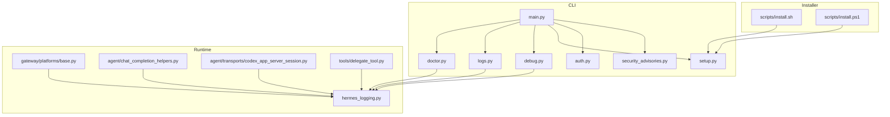

**Diagram sources**
- [main.py](file://hermes_cli/main.py)
- [doctor.py](file://hermes_cli/doctor.py)
- [logs.py](file://hermes_cli/logs.py)
- [debug.py](file://hermes_cli/debug.py)
- [setup.py](file://hermes_cli/setup.py)
- [auth.py](file://hermes_cli/auth.py)
- [security_advisories.py](file://hermes_cli/security_advisories.py)
- [hermes_logging.py](file://hermes_logging.py)
- [base.py](file://gateway/platforms/base.py)
- [chat_completion_helpers.py](file://agent/chat_completion_helpers.py)
- [codex_app_server_session.py](file://agent/transports/codex_app_server_session.py)
- [delegate_tool.py](file://tools/delegate_tool.py)
- [install.sh](file://scripts/install.sh)
- [install.ps1](file://scripts/install.ps1)

**Section sources**
- [main.py](file://hermes_cli/main.py)
- [doctor.py](file://hermes_cli/doctor.py)
- [logs.py](file://hermes_cli/logs.py)
- [hermes_logging.py](file://hermes_logging.py)
- [debug.py](file://hermes_cli/debug.py)
- [install.sh](file://scripts/install.sh)
- [install.ps1](file://scripts/install.ps1)
- [setup.py](file://hermes_cli/setup.py)
- [auth.py](file://hermes_cli/auth.py)
- [security_advisories.py](file://hermes_cli/security_advisories.py)
- [base.py](file://gateway/platforms/base.py)
- [chat_completion_helpers.py](file://agent/chat_completion_helpers.py)
- [codex_app_server_session.py](file://agent/transports/codex_app_server_session.py)
- [delegate_tool.py](file://tools/delegate_tool.py)

## Core Components
- Doctor diagnostics: Environment checks, package presence, configuration validation, provider auth, security advisories, gateway service linger, and tool availability overrides
- Logging: Centralized setup, rotating file handlers, session context tagging, component routing, and verbose mode
- Logs viewer: Tail/follow logs with filters (level, session, component, time range)
- Debug sharing: Captures system dump and logs, redacts sensitive data, uploads to paste services, schedules auto-deletion
- Installer and setup: Cross-platform installers, dependency checks, Node/Python/git checks, optional deps, and interactive setup wizard
- Authentication: Provider registry, OAuth status, provider state persistence, and known provider detection
- Security advisories: Compromised package detection, remediation steps, acknowledgments, and startup banners
- Gateway platform adapters: Scoped locks, fatal error reporting, and connectivity guards
- Runtime helpers: Partial stream handling, tool tracing, and error classification

**Section sources**
- [doctor.py](file://hermes_cli/doctor.py)
- [hermes_logging.py](file://hermes_logging.py)
- [logs.py](file://hermes_cli/logs.py)
- [debug.py](file://hermes_cli/debug.py)
- [install.sh](file://scripts/install.sh)
- [install.ps1](file://scripts/install.ps1)
- [setup.py](file://hermes_cli/setup.py)
- [auth.py](file://hermes_cli/auth.py)
- [security_advisories.py](file://hermes_cli/security_advisories.py)
- [base.py](file://gateway/platforms/base.py)
- [chat_completion_helpers.py](file://agent/chat_completion_helpers.py)
- [codex_app_server_session.py](file://agent/transports/codex_app_server_session.py)
- [delegate_tool.py](file://tools/delegate_tool.py)

## Architecture Overview
The troubleshooting architecture centers on CLI-driven diagnostics and runtime logging. Doctor orchestrates environment and configuration checks, while logging captures runtime events with session context. Debug sharing aggregates system and log data for support. Gateway platform adapters enforce resource locks and connectivity policies.

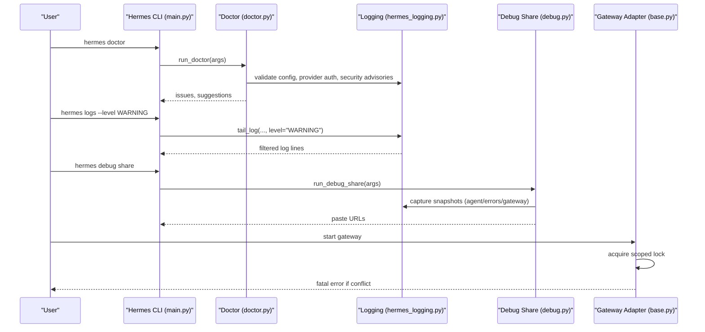

**Diagram sources**
- [main.py](file://hermes_cli/main.py)
- [doctor.py](file://hermes_cli/doctor.py)
- [hermes_logging.py](file://hermes_logging.py)
- [logs.py](file://hermes_cli/logs.py)
- [debug.py](file://hermes_cli/debug.py)
- [base.py](file://gateway/platforms/base.py)

## Detailed Component Analysis

### Doctor Diagnostics
Doctor performs environment checks, validates configuration, verifies provider authentication, scans for security advisories, and evaluates gateway service linger. It also adjusts tool availability for runtime-gated contexts and provides actionable fixes when possible.

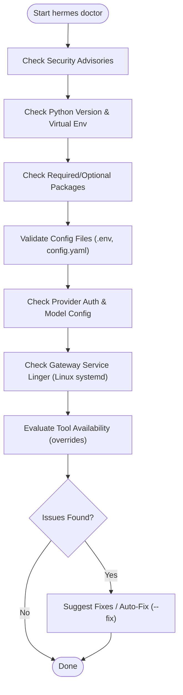

**Diagram sources**
- [doctor.py](file://hermes_cli/doctor.py)

**Section sources**
- [doctor.py](file://hermes_cli/doctor.py)

### Logging Subsystem
The logging subsystem initializes rotating file handlers, redacts secrets, routes component logs, and supports verbose console logging. It tags session context for correlation and suppresses noisy third-party loggers.

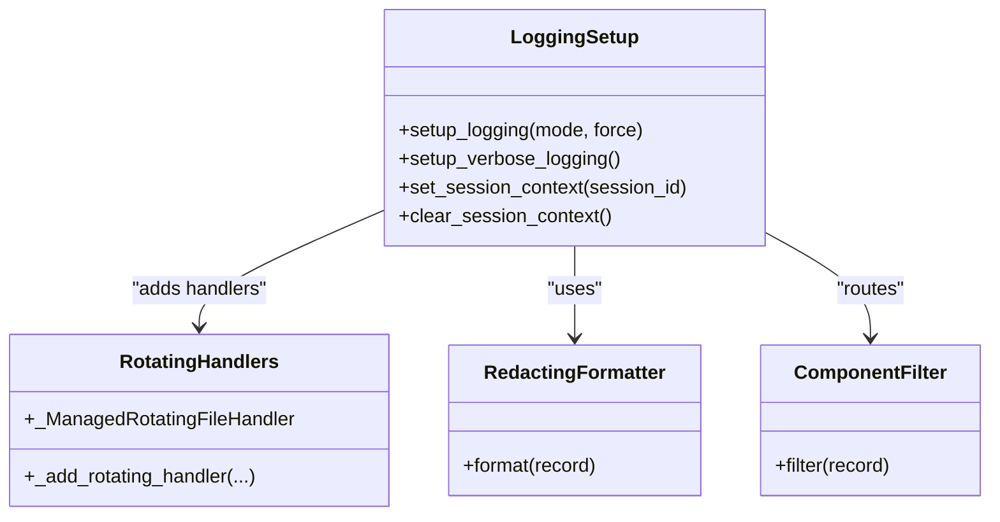

**Diagram sources**
- [hermes_logging.py](file://hermes_logging.py)

**Section sources**
- [hermes_logging.py](file://hermes_logging.py)

### Logs Viewer
The logs viewer supports tailing, following, filtering by level, session, component, and relative time windows. It parses timestamps, levels, and logger names to apply filters efficiently.

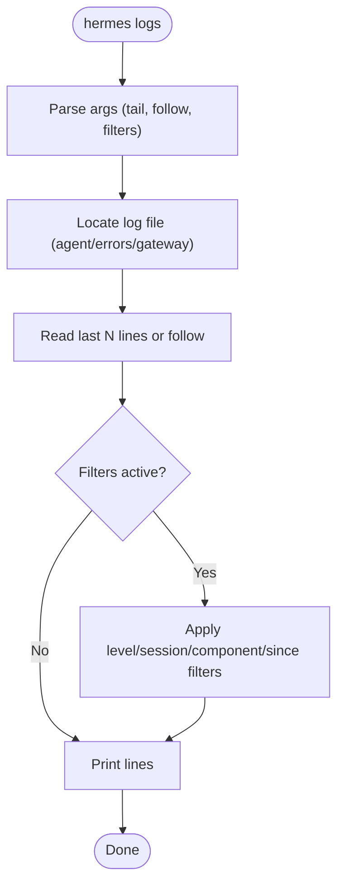

**Diagram sources**
- [logs.py](file://hermes_cli/logs.py)

**Section sources**
- [logs.py](file://hermes_cli/logs.py)

### Debug Sharing
Debug sharing collects a system dump and recent log tails, redacts sensitive data, uploads to paste services, and schedules auto-deletion. It supports local-only output and manual deletion.

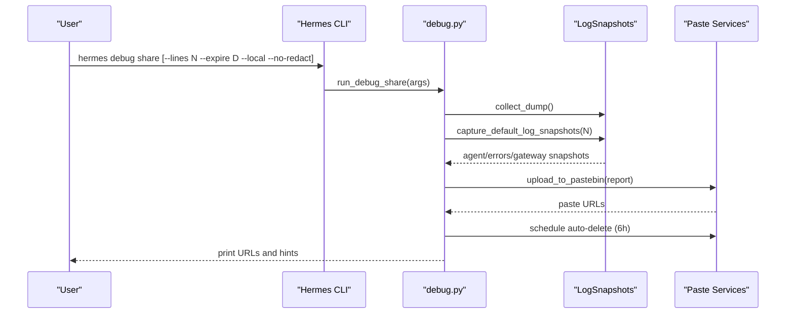

**Diagram sources**
- [debug.py](file://hermes_cli/debug.py)

**Section sources**
- [debug.py](file://hermes_cli/debug.py)

### Installer and Setup
Cross-platform installers detect OS/distro, check dependencies (Python, Git, Node), install system packages, and optionally skip setup. The setup wizard guides model/provider selection, terminal backend, agent settings, messaging platforms, and tools.

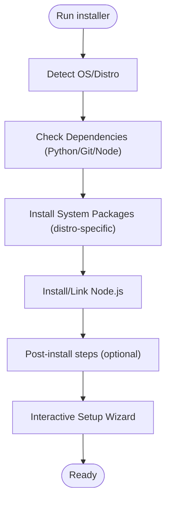

**Diagram sources**
- [install.sh](file://scripts/install.sh)
- [install.ps1](file://scripts/install.ps1)
- [setup.py](file://hermes_cli/setup.py)

**Section sources**
- [install.sh](file://scripts/install.sh)
- [install.ps1](file://scripts/install.ps1)
- [setup.py](file://hermes_cli/setup.py)

### Authentication and Providers
Authentication integrates with provider registries, OAuth statuses, and provider state persistence. It supports known provider detection and displays friendly names.

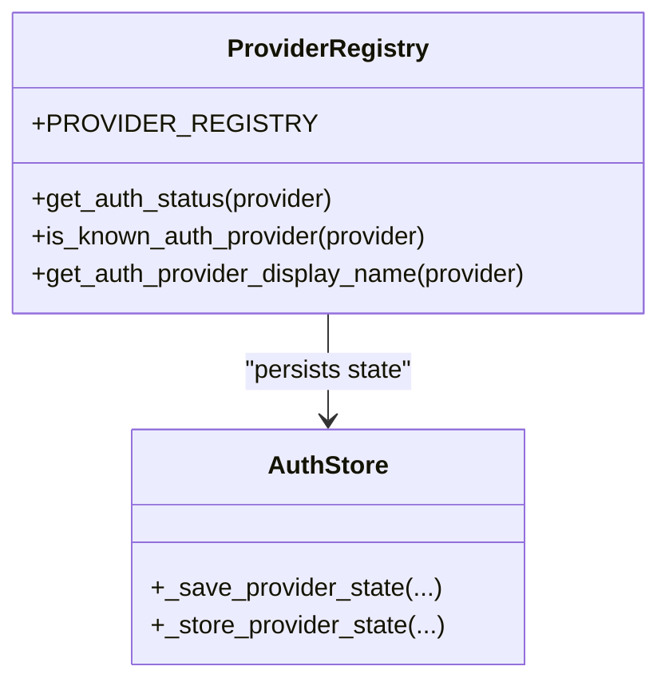

**Diagram sources**
- [auth.py](file://hermes_cli/auth.py)

**Section sources**
- [auth.py](file://hermes_cli/auth.py)

### Security Advisories
Security advisories scan for compromised packages, surface remediation steps, and support acknowledgment and startup banners.

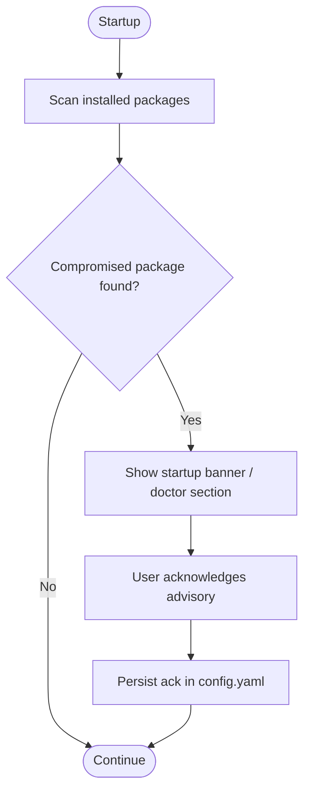

**Diagram sources**
- [security_advisories.py](file://hermes_cli/security_advisories.py)

**Section sources**
- [security_advisories.py](file://hermes_cli/security_advisories.py)

### Gateway Platform Adapters
Gateway adapters enforce scoped locks to prevent resource conflicts and report fatal errors when contention occurs. Connectivity guards ensure safe binding and access.

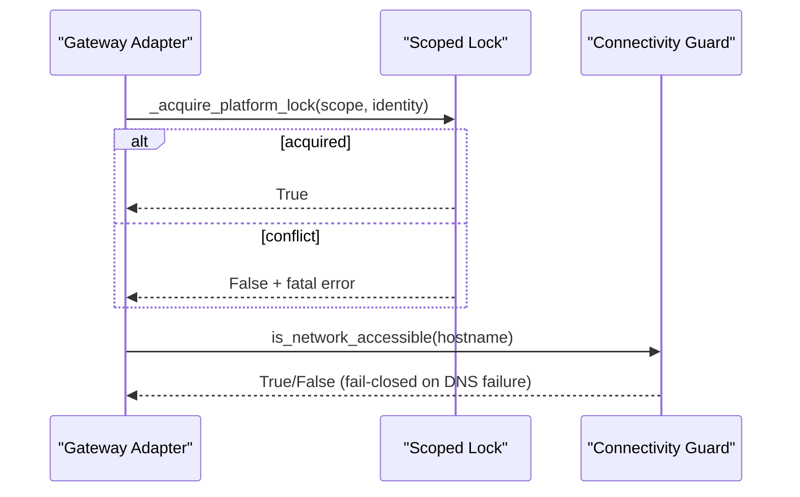

**Diagram sources**
- [base.py](file://gateway/platforms/base.py)
- [test_api_server_bind_guard.py](file://tests/gateway/test_api_server_bind_guard.py)

**Section sources**
- [base.py](file://gateway/platforms/base.py)
- [test_api_server_bind_guard.py](file://tests/gateway/test_api_server_bind_guard.py)

### Runtime Helpers
Runtime helpers handle partial streams, tool tracing, and error classification to improve resilience and observability.

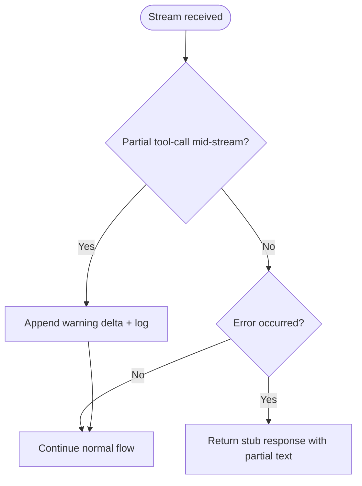

**Diagram sources**
- [chat_completion_helpers.py](file://agent/chat_completion_helpers.py)
- [codex_app_server_session.py](file://agent/transports/codex_app_server_session.py)
- [delegate_tool.py](file://tools/delegate_tool.py)

**Section sources**
- [chat_completion_helpers.py](file://agent/chat_completion_helpers.py)
- [codex_app_server_session.py](file://agent/transports/codex_app_server_session.py)
- [delegate_tool.py](file://tools/delegate_tool.py)

## Dependency Analysis
Doctor depends on logging, configuration, auth, and platform helpers. Logs rely on logging internals and component prefixes. Debug sharing depends on logging snapshots and paste services. Gateway adapters depend on status and connectivity guards.

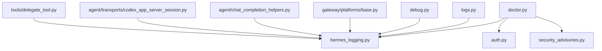

**Diagram sources**
- [doctor.py](file://hermes_cli/doctor.py)
- [hermes_logging.py](file://hermes_logging.py)
- [logs.py](file://hermes_cli/logs.py)
- [debug.py](file://hermes_cli/debug.py)
- [auth.py](file://hermes_cli/auth.py)
- [security_advisories.py](file://hermes_cli/security_advisories.py)
- [base.py](file://gateway/platforms/base.py)
- [chat_completion_helpers.py](file://agent/chat_completion_helpers.py)
- [codex_app_server_session.py](file://agent/transports/codex_app_server_session.py)
- [delegate_tool.py](file://tools/delegate_tool.py)

**Section sources**
- [doctor.py](file://hermes_cli/doctor.py)
- [hermes_logging.py](file://hermes_logging.py)
- [logs.py](file://hermes_cli/logs.py)
- [debug.py](file://hermes_cli/debug.py)
- [auth.py](file://hermes_cli/auth.py)
- [security_advisories.py](file://hermes_cli/security_advisories.py)
- [base.py](file://gateway/platforms/base.py)
- [chat_completion_helpers.py](file://agent/chat_completion_helpers.py)
- [codex_app_server_session.py](file://agent/transports/codex_app_server_session.py)
- [delegate_tool.py](file://tools/delegate_tool.py)

## Performance Considerations
- Logging: Use rotating handlers with appropriate max sizes and backup counts. Enable verbose logging only when diagnosing issues to reduce overhead.
- Streams: Partial stream handling prevents duplicate messages and reduces retries. Ensure tool timeouts and post-tool quiet timeouts are tuned for your workload.
- Memory: Monitor session context usage and avoid excessive log retention. Rotate logs regularly and prune old backups.
- Scaling: Use component filtering to isolate noisy loggers. Route gateway logs separately to reduce cross-component noise.

[No sources needed since this section provides general guidance]

## Troubleshooting Guide

### Doctor Diagnostics
- Run diagnostics to validate environment, configuration, provider auth, and security advisories.
- Use the fix flag to auto-fix non-sensitive issues when available.
- Review actionable suggestions and warnings for next steps.

**Section sources**
- [doctor.py](file://hermes_cli/doctor.py)

### Installation Problems
- Linux/macOS: Verify Python, Git, and Node are installed and on PATH. Install system packages as prompted.
- Windows: Use the PowerShell installer; ensure PowerShell execution policy allows script execution.
- Termux: Confirm Termux packages and environment variables are set correctly.

**Section sources**
- [install.sh](file://scripts/install.sh)
- [install.ps1](file://scripts/install.ps1)

### Platform-Specific Troubleshooting
- Linux: Ensure systemd unit files exist and linger is enabled for persistent gateway services.
- macOS: Confirm Xcode command line tools and Homebrew availability for optional dependencies.
- Windows: Use PowerShell installer; verify PATH and execution policy.
- Mobile (Termux): Install required packages and confirm environment variables.

**Section sources**
- [install.sh](file://scripts/install.sh)
- [install.ps1](file://scripts/install.ps1)

### Runtime Issues
- Conversation problems: Check partial stream handling and warnings for mid-stream tool-call stalls.
- Tool execution failures: Inspect tool traces and error outputs; verify tool availability and permissions.
- Gateway connectivity: Validate hostname resolution and network accessibility; ensure no conflicting gateway instances are running.

**Section sources**
- [chat_completion_helpers.py](file://agent/chat_completion_helpers.py)
- [codex_app_server_session.py](file://agent/transports/codex_app_server_session.py)
- [delegate_tool.py](file://tools/delegate_tool.py)
- [base.py](file://gateway/platforms/base.py)
- [test_api_server_bind_guard.py](file://tests/gateway/test_api_server_bind_guard.py)

### Configuration Troubleshooting
- Provider setup: Verify provider auth status and model configuration. Switch providers or update credentials as needed.
- Authentication failures: Check provider registry and OAuth status; ensure credentials are saved and active.
- Permission issues: Confirm file permissions for logs and config directories; ensure write access to ~/.hermes.

**Section sources**
- [auth.py](file://hermes_cli/auth.py)
- [doctor.py](file://hermes_cli/doctor.py)

### Performance Optimization
- Tune logging levels and retention; suppress noisy third-party loggers.
- Adjust tool timeouts and post-tool quiet timeouts to balance responsiveness and reliability.
- Monitor memory usage and scale horizontally if needed.

**Section sources**
- [hermes_logging.py](file://hermes_logging.py)
- [logs.py](file://hermes_cli/logs.py)

### Security-Related Troubleshooting
- Security advisories: Review detected advisories and follow remediation steps; acknowledge advisories to suppress repeated banners.
- Approval system: Ensure approvals are properly configured and enforced by platform adapters.
- Credential issues: Rotate compromised credentials and verify provider auth status.
- Access control: Validate provider scopes and permissions; review gateway platform adapter locks.

**Section sources**
- [security_advisories.py](file://hermes_cli/security_advisories.py)
- [base.py](file://gateway/platforms/base.py)
- [auth.py](file://hermes_cli/auth.py)

### Debugging Techniques and Log Analysis
- Use the logs viewer to tail/follow logs with filters for level, session, component, and time range.
- Enable verbose logging for detailed console output during diagnosis.
- Share debug reports with paste services for support; redaction is applied by default.

**Section sources**
- [logs.py](file://hermes_cli/logs.py)
- [hermes_logging.py](file://hermes_logging.py)
- [debug.py](file://hermes_cli/debug.py)

### Frequently Asked Questions
- Why is my provider not working?
  - Check provider auth status and model configuration. Ensure credentials are set and provider is recognized.
- How do I fix gateway service lingering on Linux?
  - Enable systemd linger for the user to keep the service alive after logout.
- Why are my logs not showing up?
  - Ensure Hermes has been run to generate logs; check log file locations and permissions.
- How do I share logs with support?
  - Use the debug share command to upload a redacted report and full logs to paste services.

**Section sources**
- [doctor.py](file://hermes_cli/doctor.py)
- [logs.py](file://hermes_cli/logs.py)
- [debug.py](file://hermes_cli/debug.py)

## Conclusion
This guide consolidates practical troubleshooting steps, diagnostic workflows, and platform-specific guidance for the Hermes Agent. Use the doctor command for environment and configuration checks, leverage the logging subsystem for runtime visibility, and follow the platform-specific installation and setup instructions. For persistent issues, use the debug sharing feature to gather contextual information and consult community resources.

[No sources needed since this section summarizes without analyzing specific files]

## Appendices

### Quick Reference Commands
- Diagnostics: hermes doctor [--fix]
- Logs: hermes logs [-f] [--level] [--session] [--component] [--since]
- Debug: hermes debug share [--lines N] [--expire D] [--local] [--no-redact]
- Setup: hermes setup
- Gateway: hermes gateway [start|stop|status|install|uninstall]

**Section sources**
- [main.py](file://hermes_cli/main.py)
- [doctor.py](file://hermes_cli/doctor.py)
- [logs.py](file://hermes_cli/logs.py)
- [debug.py](file://hermes_cli/debug.py)
- [setup.py](file://hermes_cli/setup.py)